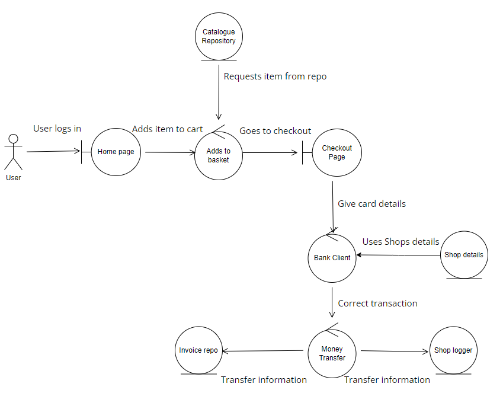

<h1>COM528 AE2 Documentation</h1>

<h2 style="text-decoration: underline">Important Information:</h2>

Admin username: globaladmin 
Admin password: globaladmin

User username: user1234 
User password: user1234

---

<h2 style="text-decoration: underline">Introduction:</h2>

This is the documentation that I have done for my software. It highlights the different interactions many actions and actors have in the system while they navigate and work their way through the app. 

---

<h2 style="text-decoration: underline">How to run:</h2>

To run the software simply locate the project file inside NetBeans after you have unzipped the file, open the project, right click on the web module and select the Run option to start the server, if asked for details enter your tomcat server details or the default. Should there be an error, clean and build each module and try again. 

---

<h2 style="text-decoration: underline">Use Case Diagram:</h2>

Use case diagrams illustrate the main requirements of a system and shows key interactions between the actors and the system by describing what its supposed to do. They are primarily made before starting a project to highlight the important functions so that all the participants involved understand what its supposed to happen in an ideal scenario with a customer interacting with the system. Below there is a use case for both the user and admin, showing what they should be able to do within the application and how that connects together with the bank for a transaction, which is the main feature of the software:

---

<h2 style="text-decoration: underline">Robust Diagram:</h2>

Robustness diagrams illustrate how the user interacts with different objects within the system in an internal level, how data interacts with interface and controllers to make the application work the way its supposed to. Below is a robustness diagram for the user doing a transaction and a robustness diagram for the admin viewing and adding details from the server:

 User 

 Admin 

---

<h2 style="text-decoration: underline">Sequence Diagram:</h2>

Sequence diagrams show how objects in a system or classes within code interact one another, more importantly it shows the order the actions taking place, showing the sequence of events for a better understanding of how every information flows from one bit of code to the next to complete tasks and requirements within the system. In the first sequence diagram the user enters the page, wants to log in, add items, and make a transaction. In the second diagram, an admin wants to log in, add a new item to the database, check the orders, and set the shop details. Below is a sequence diagram for a user doing a transaction and a sequence diagram for the admin showing and adding details:

 User 

 Admin 

---

<h2 style="text-decoration: underline">Model Diagram:</h2>

 A model diagram is a graphical visualization of the object orientation that goes thought out the system. It highlights the structure of a system by showing the various classes, attributes, methods and different relationships inside the software for a better understanding of the implementation and function.

---

<h2 style="text-decoration: underline"> Javadoc:</h2>

Javadoc is a documentation generator for Java, allowing users to generate API documentation in HTML format from Java source code to describe classes, methods, functions and many more. To generate, right click on a module and select generate Javadoc, some images of the results are provided below:

---

<h2 style="text-decoration: underline">Test Plan:</h2> 

A Test Plan is a document that describes the test strategy, objective, estimate and result required to perform successful testing for a software. Its important because it helps determine the effort needed to quickly test the quality of the application and what its able to do. Below are the test plans I have covered during the making of the software:

<h2>Test 1:</h2>

|          Test           |                            Expected Result                             |                            Actual Result                             |          Success or Failure           | Action needed |
| :---------------------: | :--------------------------------------------------------------------: | :------------------------------------------------------------------: | :---------------------------------: | :-----------: |
| Web pages and bootstrap | All web pages to load correctly with bootstrap working within them all | Every page loads as intended and bootstrap is used within every page | Success  |     none      |

 

<h2>Test 2:</h2>

|  Test  |                                         Expected Result                                         |                         Actual Result                          |          Success or Failure           | Action needed |
| :----: | :---------------------------------------------------------------------------------------------: | :------------------------------------------------------------: | :---------------------------------: | :-----------: |
| User and Admin logins | User and Admin can succesfully log in the aplication with the correct account details, otherwise they get an error | The admin and users can log in succesfully while using the correct account details only | Success  |     none      |

 

<h2>Test 3:</h2>

|     Test     |                                       Expected Result                                        |             Actual Result              |          Success or Failure           | Action needed |
| :----------: | :------------------------------------------------------------------------------------------: | :------------------------------------: | :---------------------------------: | :-----------: |
| User shopping | The user should be able to view the available items and add them to a cart | The user can succesfully add items to the shopping cart, viewing quantity and getting a total amount | Success |     none      |

 

<h2>Test 4:</h2>

|         Test         |                                Expected Result                                 |         Actual Result          |         Success or Failure          | Action needed |
| :------------------: | :----------------------------------------------------------------------------: | :----------------------------: | :---------------------------------: | :-----------: |
| Check out/Transaction | When the user is done shopping they can checkout using their card details and make a transaction happen with the total amount | The transaction happens with no errors to the user's account taking in account the total amount | Success |     none      |

 

<h2>Test 5:</h2>

|            Test             |                                      Expected Result                                      |                          Actual Result                          |          Success or Failure           | Action needed |
| :-------------------------: | :---------------------------------------------------------------------------------------: | :-------------------------------------------------------------: | :---------------------------------: | :-----------: |
| Logger tracks transactions | The logger should track all transactions made regardless of correct or incorrect information has been given | The logger tracks the card number of the user and the amount paid while also logging erros | Success |     none      |

 

<h2>Test 6:</h2>

|    Test     |                                       Expected Result                                       |                      Actual Result                      |          Success or Failure           | Action needed |
| :---------: | :-----------------------------------------------------------------------------------------: | :-----------------------------------------------------: | :---------------------------------: | :-----------: |
| User orders | Logged in users should be able to view their orders | Logged in users can view all orders like the admin | Failed |    Figure out a way to make it so users can view only their orders      |

 

<h2>Test 7:</h2>

|             Test              |                                                      Expected Result                                                      |                       Actual Result                        |          Success or Failure           | Action needed |
| :---------------------------: | :-----------------------------------------------------------------------------------------------------------------------: | :--------------------------------------------------------: | :---------------------------------: | :-----------: |
| Admin modify users | The admin should be able to modify users such as changing their status | The admin can succesfully view the modify user jsp and modify users | Success |     none      |

 

<h2>Test 8:</h2>

|  Test   |                                 Expected Result                                 |                           Actual Result                            |         Success or Failure           | Action needed |
| :-----: | :-----------------------------------------------------------------------------: | :----------------------------------------------------------------: | :---------------------------------: | :-----------: |
| Admin catalog | Admin should be able to add and remove items from the list of available items | Admin can add items but cant remove | Failed |    Figure out a way to remove item from the repo      |

 

<h2>Test 9:</h2>

|        Test         |                    Expected Result                     |                         Actual Result                          |          Success or Failure           | Action needed |
| :-----------------: | :----------------------------------------------------: | :------------------------------------------------------------: | :---------------------------------: | :-----------: |
| Admin shop details | The admin should be able to set the shop details such as url and card details that will be used during the transaction | The admin can succesfully view the shop details page and add the url and card details to be used during a transaction | Success |     none      |

 

<h2>Test 10:</h2>

|  Test   |                                 Expected Result                                 |                           Actual Result                            |         Success or Failure           | Action needed |
| :-----: | :-----------------------------------------------------------------------------: | :----------------------------------------------------------------: | :---------------------------------: | :-----------: |
| Admin viewing orders | Admin should be able to view all the orders made from all users | Admin can view all orders | Success |    None      |

 

<h2>Test 11:</h2>

|  Test   |                                 Expected Result                                 |                           Actual Result                            |         Success or Failure           | Action needed |
| :-----: | :-----------------------------------------------------------------------------: | :----------------------------------------------------------------: | :---------------------------------: | :-----------: |
| Incorrect Transaction | If any information is wrong during the transaction, the user should be notified and brough back to the checkout page | The user is succesfully brought back to the checkout page if any error is wrong and it is also logged | Success |    none      |

 
